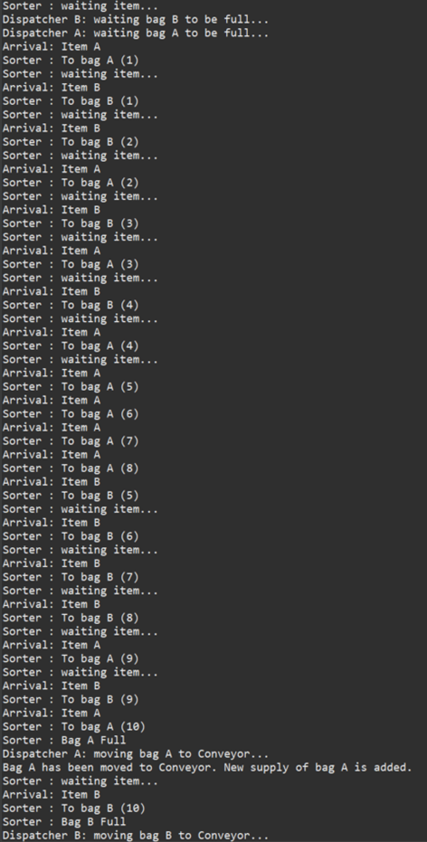

# MultithreadingSimulator

## Overview

This is a simple simulator for multithreading in operating system which is developed using java. The warehouse process is used in this program to simulate the process of multithreading in operating system.

#### Workflow
There are two items, namely item A and B, and the program will randomly generate them. After the item is generated, it will then be moved to the sorter, and the sorter will add the item into a storage bag (bag A or B) according to the type of item. Once the storage bag reaches the maximum capacity (10 items per bag), the relative dispatcher (dispatcher A or B) will then move the bag to the conveyor, and a new supply of the bag will be added.

## Tools
1. Java
2. Eclipse IDE

## Usage
Import the files into your project. 
Run the project with Java compiler.

## Test
Manual testing has been performed.

## Previews
  

## Contributors
1. Lean Wei Liang
2. Seow Kai Sheng
3. Tan Yuan Jie
4. Wo Zi Rock
